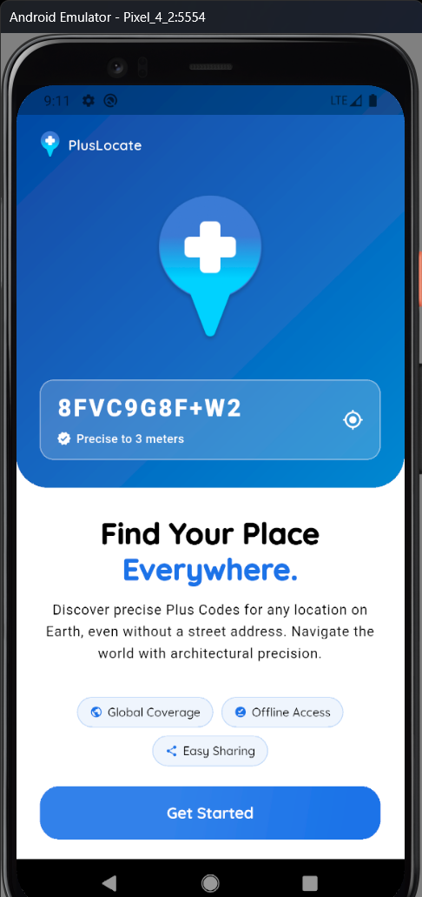
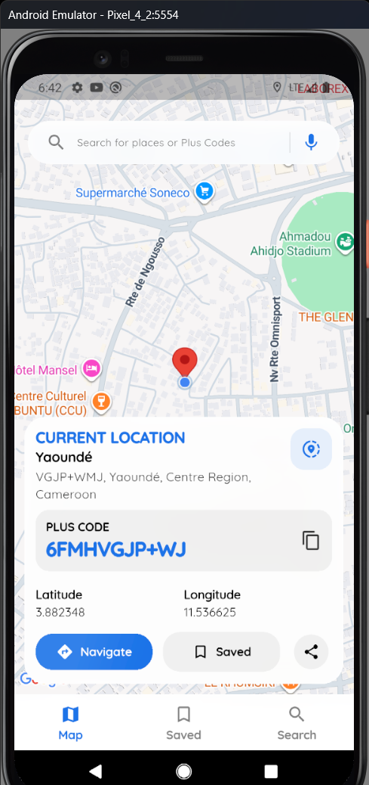
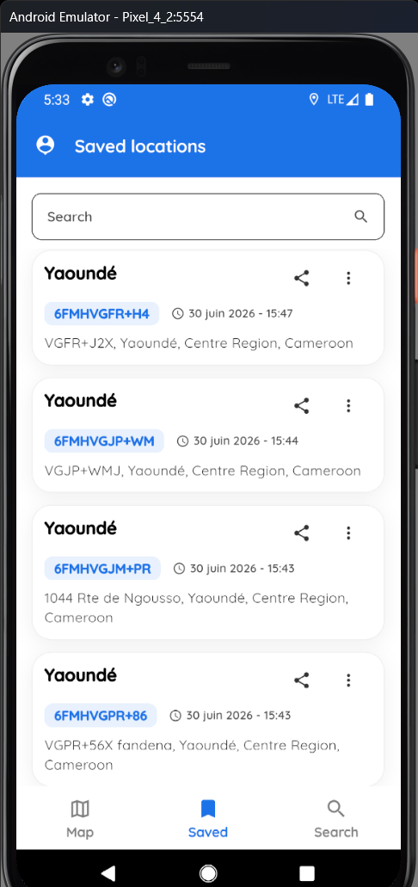
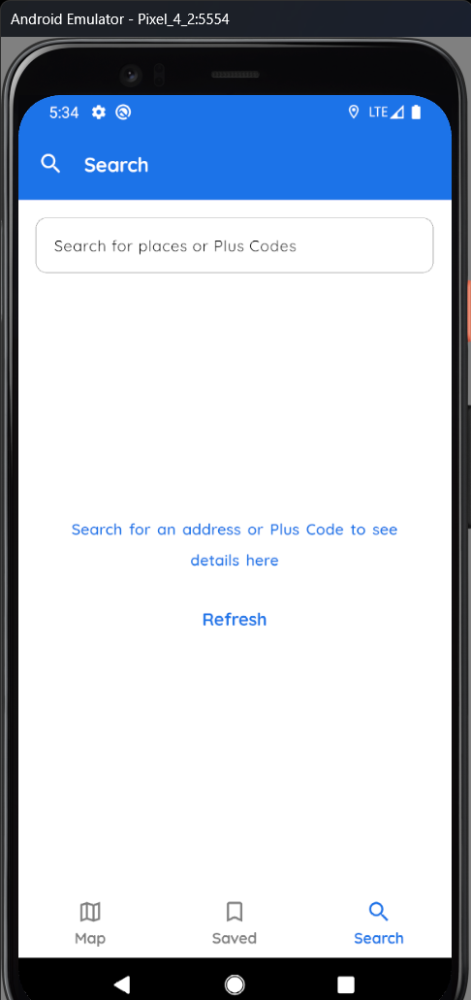

<div align="center">


# PlusLocate

**Precise, shareable locations for places that street addresses don't reach.**

Generate, search, save and share [Google Plus Codes](https://maps.google.com/pluscodes/) from a fast, map-first Flutter app.


</div>

---

## Why PlusLocate?

Much of the world has no reliable street addressing: informal settlements, rural areas, large campuses and new developments. That makes deliveries, navigation and emergency response harder than they should be.

Plus Codes fix this. They divide the globe into a grid and give every cell a short code such as `8FVC9G8F+6W`. A code is computed directly from latitude and longitude, works offline, and needs no central database.

PlusLocate turns that system into a focused mobile tool. Point at a place and get its code, or enter a code or an address and find the place. It aims to be a small utility that does one job well, not another full maps app.

---

## Screenshots

| Onboarding | Map | Saved locations | Search |
|:---:|:---:|:---:|:---:|
|  |  |  |  |

---

## Features

### 🗺️ Map
- Tap anywhere on the map, or use your current GPS position, to get its Plus Code instantly. Encoding runs on the device.
- Reverse geocoding shows the locality and a readable address when one is available. If the lookup fails, the Plus Code and coordinates are still shown.
- A detail card shows the code, coordinates and actions: **Navigate**, **Save**, **Share** and **Copy**.
- Map controls switch between map layers and re-center on your position.

### 🔎 Search
- **Live suggestions** come from Google **Places API (New)**. Requests are debounced and grouped into billing sessions.
- **Type anything.** Search understands a full Plus Code (`8FVC9G8F+6W`), a short code with a town (`9G8F+6W Douala`), or an address. Plus Codes are decoded on the device, with no API call.
- **Automatic fallback.** Each device can make a limited number of autocomplete searches per month (`SearchQuotaRepository`). After that, and whenever suggestions are unavailable, pressing search uses the free on-device geocoder.
- Results open in the same detail card, with an extra **View on Map** action.

### 🔖 Saved locations
- Saved locations are stored on the device with Hive, so they're available offline.
- Saving the same Plus Code again **updates the existing entry** and moves it to the top, so there are no duplicates.
- Filter saved locations by code, label or locality.
- Tap a saved location to jump to it on the map.
- Long-press to start **multi-select**, then select all or delete in bulk. Single delete asks for confirmation.

### ✨ Everywhere else
- Share via the native share sheet, and copy to the clipboard with one tap.
- **Navigate** hands off to Google Maps for turn-by-turn directions.
- A first-launch **onboarding** screen is shown once.
- Fully localized in **English** and **French**, with no hardcoded UI strings.
- Over-the-air updates with **Shorebird**.

---

## Architecture

PlusLocate uses a pragmatic, layered architecture: UI, then BLoC, then Repository, then Provider. It keeps enough separation to stay maintainable without ceremony a small app doesn't need.

```
lib/
├── main.dart                 # Zone-guarded entry point, native splash, Hive init
├── plus_locate.dart          # Barrel export for the whole app
└── src/
    ├── core/                 # Bootstrap, DI (Application), routing, l10n, theming
    │   ├── routing/          # go_router config, onboarding redirect, bottom-nav shell
    │   └── l10n/             # app_en.arb, app_fr.arb (+ generated localizations)
    ├── data/api/             # Providers wrapping device/3rd-party APIs
    │   ├── plus_code/        #   open_location_code (on-device encode/decode)
    │   ├── geocoding/        #   native geocoder (timeout-safe)
    │   └── places/           #   Places API (New) over dio
    ├── domain/
    │   ├── models/           # freezed models: PlusCode, LocationResult, SavedCode, PlaceSuggestion
    │   └── repository/       # PlusCode, Geocoding, Places, SavedCodes (Hive), SearchQuota
    ├── features/             # One folder per feature: bloc/ + views/ (+ components/)
    │   ├── map_view/         #   main map tab
    │   ├── search/           #   address / Plus Code search tab
    │   ├── history/          #   saved locations tab
    │   └── onboarding/       #   first-launch screen
    └── shared/               # Reusable widgets, extensions, utilities
```

**Key decisions**

| Concern | Choice |
|---|---|
| State management | `flutter_bloc` with `freezed` events and states. Views stay thin and logic lives in BLoCs. |
| Navigation | `go_router`. Map, Saved and Search sit in a `StatefulShellRoute.indexedStack`, so each tab keeps its state. |
| Persistence | `hive` for saved locations and the search quota. `flutter_secure_storage` for the onboarding flag. |
| Plus Codes | `open_location_code` encodes and decodes entirely on the device, with no network calls. |
| Geocoding | The platform-native geocoder via `geocoding`, wrapped with timeouts so failures never block the UI. |
| Place search | A direct Places API (New) client on `dio`. Its session tokens make a typed search plus its selection bill as one session. |
| Layout | Every page uses the shared `ResponsiveScaffoldWrapper`. |

---

## Getting started

### Prerequisites
- Flutter SDK with Dart ≥ 3.6
- A Google Cloud project with an API key that has these APIs enabled:
  - **Maps SDK for Android** and **Maps SDK for iOS**, for the map
  - **Places API (New)**, for search suggestions (`places.googleapis.com/v1`)

### 1. Install and generate code

```bash
git clone https://github.com/afesohromeo/plus_locate.git
cd plus_locate
flutter pub get            # also generates localizations (ARB → AppLocalizations)

# freezed models/blocs
dart run build_runner build
```

### 2. Configure API keys

Keys are read from three places, and none of them are committed.

| Where | Used for | How |
|---|---|---|
| `android/local.properties` | Android map tiles | Add `MAPS_API_KEY=your_key`. It's injected into `AndroidManifest.xml`. |
| `ios/Flutter/Secrets.xcconfig` | iOS map tiles | Copy `Secrets.xcconfig.example` and set `MAPS_API_KEY`. It's read via `Info.plist`. |
| `--dart-define` | Search suggestions (Dart code) | `--dart-define=GOOGLE_MAPS_API_KEY=your_key`. You can add `PLACES_API_KEY=…` to use a separate key. |

> **Tip:** Restrict each key in the Google Cloud Console. Use Android/iOS app restrictions for the Maps SDK keys, and limit the search key to **Places API (New)** only. Also set a daily quota and a budget alert. The in-app monthly quota smooths costs, but it isn't a hard limit.

### 3. Run

```bash
flutter run --dart-define=GOOGLE_MAPS_API_KEY=your_key
```

If you launch from VS Code, make sure the launch configuration you pick passes the same `--dart-define`. Without it, search shows "suggestions are unavailable", though pressing search still works through the device geocoder.

### Tests

```bash
flutter test
```

---

## Releasing with Shorebird

The app is set up for [Shorebird](https://shorebird.dev) code push (`shorebird.yaml` is bundled as an asset).

```bash
shorebird release android --dart-define=GOOGLE_MAPS_API_KEY=your_key   # store build
shorebird patch android   --dart-define=GOOGLE_MAPS_API_KEY=your_key   # OTA Dart-only fix
```

Release signing reads `android/key.properties`, which is git-ignored.

---

## Roadmap

- [ ] Settings screen (language, map type, light/dark theme)
- [ ] Custom labels for saved locations
- [ ] Organize saved locations into folders or categories
- [ ] Routes linking several Plus Codes

---

## Tech stack

**Flutter** · **flutter_bloc** · **freezed** · **go_router** · **google_maps_flutter** · **geolocator** · **geocoding** · **open_location_code** · **Places API (New)** · **dio** · **hive** · **flutter_secure_storage** · **share_plus** · **url_launcher** · **Shorebird**

---

<div align="center">

Built by **Afesoh Romeo**

</div>
